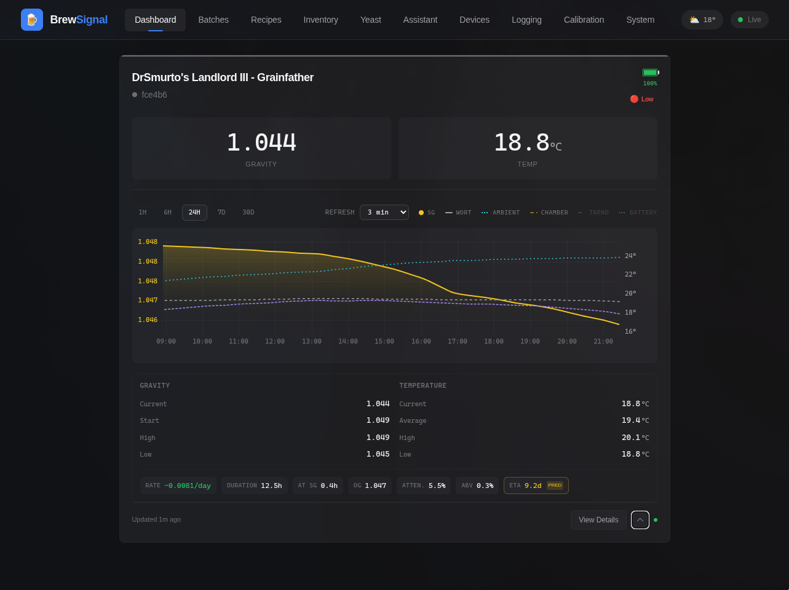

# Tilt UI

A modern web interface for monitoring Tilt Hydrometer fermentation data on Raspberry Pi.



## Features

- **Real-time Monitoring** - Live SG and temperature readings via WebSocket
- **Historical Charts** - Interactive uPlot charts with 1H/6H/24H/7D/30D time ranges
- **Calibration** - Linear interpolation between calibration points for SG and temperature
- **Multi-Tilt Support** - Monitor multiple Tilts simultaneously (Red, Green, Black, Purple, Orange, Blue, Yellow, Pink)
- **Data Export** - Download all readings as CSV
- **Dark Theme** - Easy on the eyes during late-night brew checks

## Requirements

- Raspberry Pi (3B+ or newer recommended)
- Python 3.11+
- Bluetooth adapter (built-in or USB)
- Tilt Hydrometer

## Quick Start

### Installation

```bash
# Clone the repository
git clone https://github.com/machug/tilt_ui.git
cd tilt_ui

# Create virtual environment and install
python3 -m venv venv
source venv/bin/activate
pip install -e .

# Run the server
uvicorn backend.main:app --host 0.0.0.0 --port 8080
```

Access the UI at `http://<raspberry-pi-ip>:8080`

### Systemd Service (Production)

```bash
# Copy service file
sudo cp deploy/tiltui.service /etc/systemd/system/

# Enable and start
sudo systemctl daemon-reload
sudo systemctl enable tiltui
sudo systemctl start tiltui
```

## Configuration

### Environment Variables

| Variable | Description | Default |
|----------|-------------|---------|
| `TILT_MOCK` | Enable mock scanner for development | `false` |
| `TILT_FILES` | Path to TiltPi JSON files (legacy mode) | - |
| `TILT_RELAY` | IP of remote TiltPi to relay from | - |

### Scanner Modes

1. **BLE Mode** (default) - Direct Bluetooth scanning for Tilt devices
2. **Mock Mode** - Simulated readings for development (`TILT_MOCK=true`)
3. **File Mode** - Read from TiltPi JSON files (`TILT_FILES=/home/pi`)
4. **Relay Mode** - Fetch from remote TiltPi (`TILT_RELAY=192.168.1.100`)

## API Endpoints

| Endpoint | Method | Description |
|----------|--------|-------------|
| `/api/tilts` | GET | List all detected Tilts |
| `/api/tilts/{id}` | GET | Get specific Tilt |
| `/api/tilts/{id}` | PUT | Update Tilt (beer name) |
| `/api/tilts/{id}/readings` | GET | Historical readings |
| `/api/tilts/{id}/calibration` | GET/POST | Calibration points |
| `/api/config` | GET/PATCH | Application settings |
| `/api/system/info` | GET | System information |
| `/ws` | WebSocket | Real-time readings |
| `/log.csv` | GET | Export all data as CSV |

## Calibration

Add calibration points to correct SG and temperature readings:

1. Take a reference reading with a hydrometer/thermometer
2. Note the raw value shown in Tilt UI
3. Add a calibration point: raw value → actual value
4. The system uses linear interpolation between points

## Development

```bash
# Backend (FastAPI)
cd tilt_ui
pip install -e ".[dev]"
uvicorn backend.main:app --reload

# Frontend (Svelte)
cd frontend
npm install
npm run dev
```

### Building Frontend

```bash
cd frontend
npm run build  # Outputs to backend/static/
```

## Tech Stack

- **Backend**: FastAPI, SQLAlchemy 2.0 (async), SQLite, Bleak (BLE)
- **Frontend**: SvelteKit, TailwindCSS, uPlot
- **Deployment**: Systemd, uvicorn

## License

MIT

## Acknowledgments

- [Tilt Hydrometer](https://tilthydrometer.com/) for the awesome hardware
- [TiltPi](https://github.com/baronbrew/TiltPi) for inspiration
